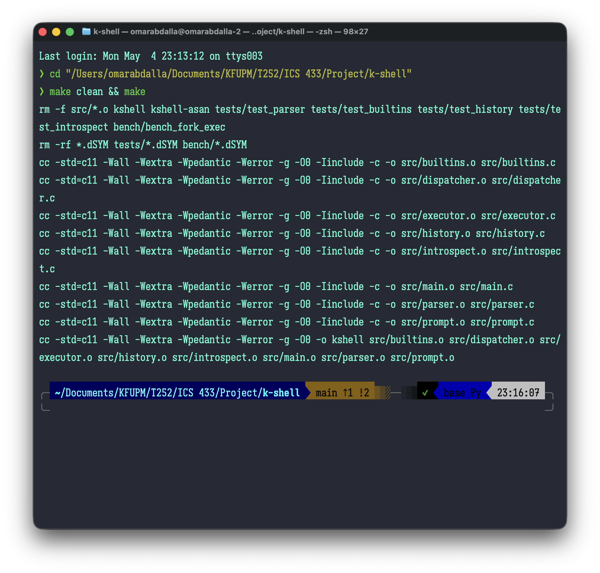
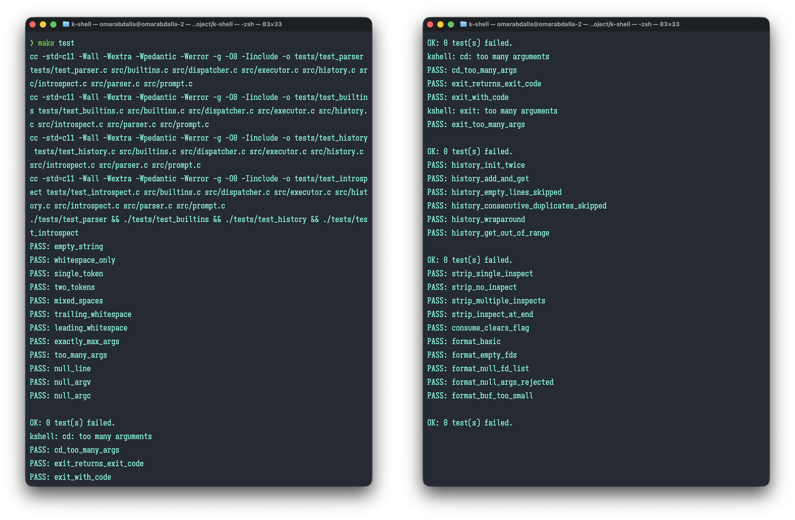
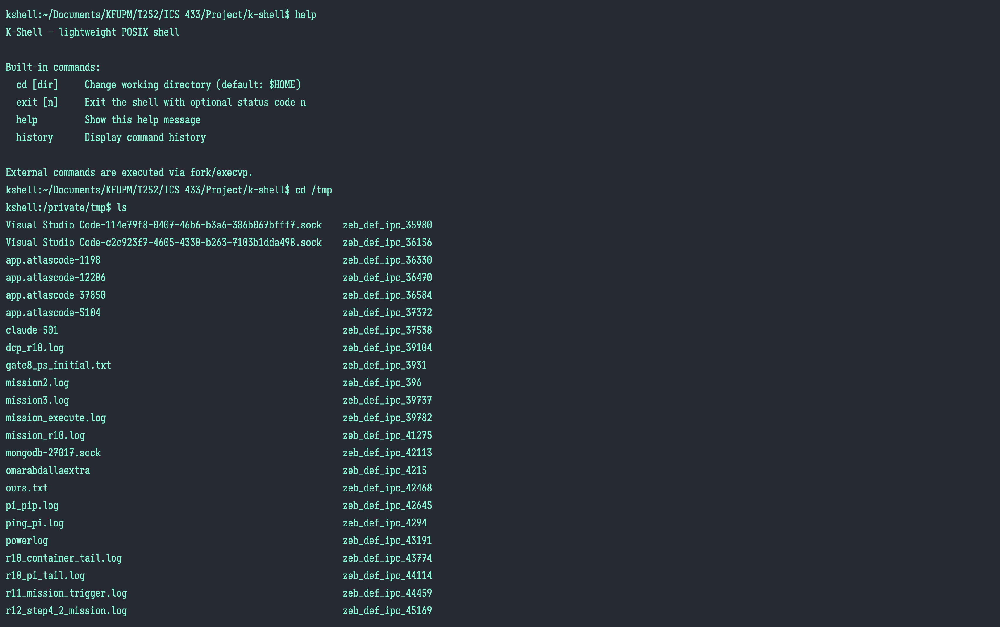
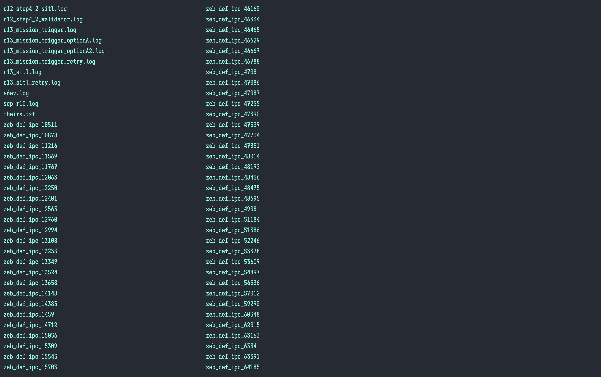
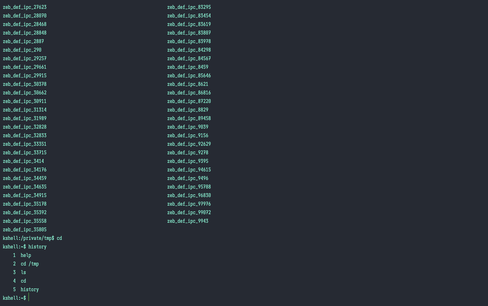
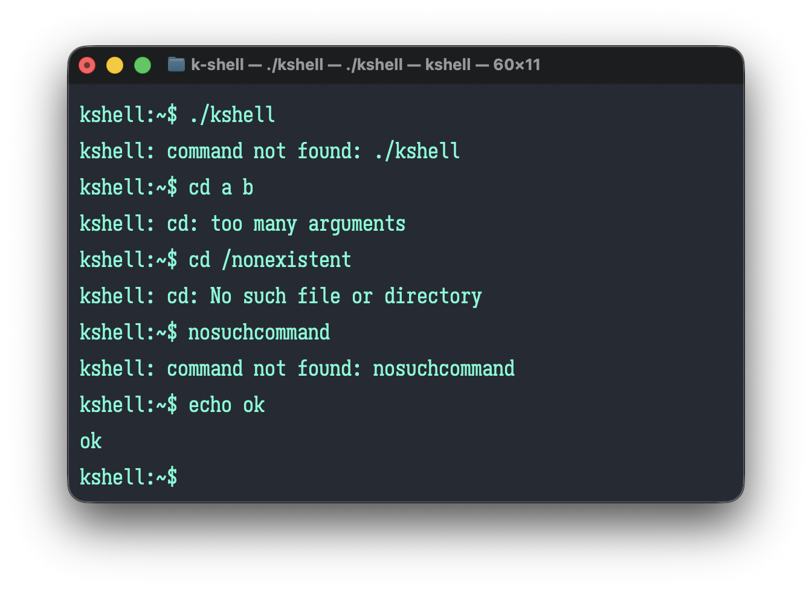
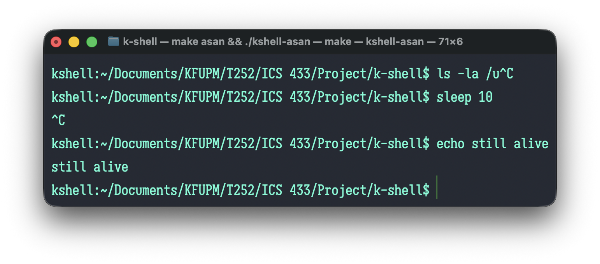
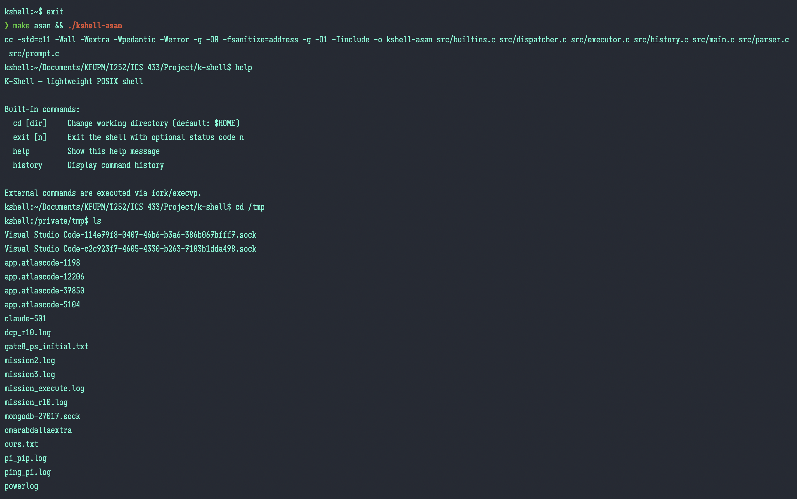
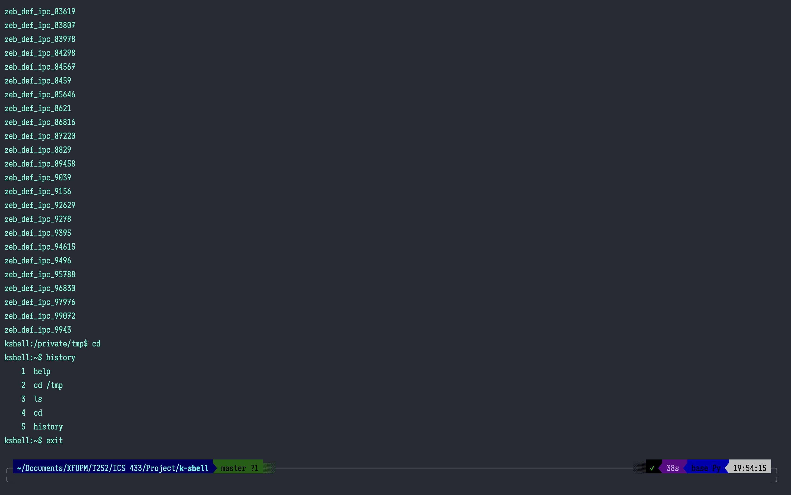

```{=latex}
\renewcommand{\thesection}{\arabic{section}}
\renewcommand{\thesubsection}{\arabic{section}.\arabic{subsection}}
```

# Project Recap

K-Shell is a lightweight, POSIX-compliant Unix shell written in C11. It operates as a command-line interpreter between the user and the operating-system kernel: it reads a line of input, tokenizes it, routes the command to an appropriate handler (built-in or external executable), and repeats until the user exits. The shell supports four built-in commands (`cd`, `exit`, `help`, `history`), external command execution via `fork`/`execvp`/`waitpid`, an in-memory ring-buffer history, a dynamic prompt showing the current working directory, and SIGINT handling that keeps the shell alive while allowing foreground children to be interrupted.

The motivation for the project is to explore foundational operating-system concepts through hands-on implementation rather than study alone. Building a shell requires direct interaction with the POSIX process model (fork, exec, wait), signal delivery and disposition, file-descriptor inheritance, environment-variable lookup, and manual memory management -- all of which are covered in the ICS 433 curriculum. The implementation directly maps to Phase 1 §1.1 (REPL loop), §1.2 (built-in commands), §1.3 (external command execution), and §1.4 (signal handling and history).

---

# Current Implementation Status

All Phase 1 requirements (§1.1–1.4) are fully implemented. The seven milestones below collectively constitute the complete K-Shell system.

## M0 — Scaffold

M0 established the repository layout: the `include/`, `src/`, `tests/`, and `report/` directories; the single public header `include/kshell.h` with stub declarations for every module; the `Makefile` with `all`, `test`, `asan`, and `clean` targets; and the `README.md`. All public function declarations in `kshell.h` carry Doxygen-style comments with `@brief`, `@param`, `@return`, and `@note` fields. A key build-system decision made in this milestone was the `LIB_SRCS := $(filter-out src/main.c, $(SRCS))` variable, which excludes `src/main.c` from test compilations so that each test driver can define its own `main()` without a duplicate-symbol linker error.

## M1 — REPL Loop and Prompt

M1 implemented the read-eval-print loop in `src/main.c` and the prompt renderer in `src/prompt.c`. The REPL uses `fgets` for input; `errno` is zeroed before each call so that the subsequent NULL-return branch can reliably distinguish a genuine end-of-file (checked via `feof` first) from a signal-interrupted read (checked via `errno == EINTR`). The prompt renderer (`ks_render_prompt`) calls `getcwd` into a stack buffer, then checks whether the path begins with `$HOME` using `strncmp` -- but critically also checks that the next character is `/` or `\0` before substituting `~`. This boundary check prevents a path like `/Users/omarchive` from being incorrectly rendered as `~chive` when `$HOME` is `/Users/omar`. No heap allocation is performed in this module.

## M2 — Parser

M2 implemented `src/parser.c`. The `ks_parse_line` function tokenizes the input line in-place using `strtok_r` (the reentrant, POSIX-standard variant of `strtok`), writing pointers directly into the caller's line buffer. The function accepts at most `KS_MAX_ARGS` (64) tokens; on the 65th token it sets `argv[KS_MAX_ARGS] = NULL` and returns `KS_ERR_TOO_MANY_ARGS`, keeping the array NULL-terminated even on the error path. The null-termination invariant (`argv[argc] == NULL`) is required by `execvp` and is explicitly tested in the unit suite. Twelve unit tests in `tests/test_parser.c` cover empty input, whitespace-only input, mixed delimiters, leading/trailing whitespace, the exact boundary at 64 tokens, rejection at 65 tokens, and all three NULL-parameter error paths.

## M3 — Dispatcher and Built-ins

M3 implemented `src/dispatcher.c` and the four built-in handlers in `src/builtins.c`. The dispatcher uses four sequential `strcmp` comparisons against `"cd"`, `"exit"`, `"help"`, and `"history"`; if none match it falls through to `ks_execute`. The `ks_builtin_exit` function does not call `exit()` directly; it stores the exit code in a module-static `g_exit_code` and returns the positive sentinel `KS_EXIT`, which the REPL loop in `main.c` interprets as a clean-exit signal. This tri-state return convention (negative = error, zero = success, positive = sentinel) is used consistently across all dispatched functions and allows `main` to distinguish "built-in failed, re-prompt" from "built-in requested termination" without an out-parameter or global flag.

## M4 — External Command Execution

M4 implemented `src/executor.c`. `ks_execute` calls `fork()`; the parent immediately calls `waitpid` to reap the child. In the child, `execvp(argv[0], argv)` replaces the process image; if it returns, `errno` is inspected and the child prints a specific error message before calling `_exit` (not `exit`) to avoid flushing the parent's `stdio` buffers inherited across the `fork`. The `errno` dispatch covers `ENOENT` (exit 127, "command not found") and `EACCES` (exit 126, "permission denied"), matching the bash convention. Exit status is decoded with `WIFEXITED`/`WEXITSTATUS` and `WIFSIGNALED`/`WTERMSIG`; the `WIFSIGNALED` path stores `128 + WTERMSIG(status)` in a module-static `g_last_status`, also following the bash convention.

## M5 — Command History

M5 implemented `src/history.c` and the `history` built-in. The storage is a fixed-capacity ring buffer of heap-allocated strings. `ks_history_init` takes a `capacity` parameter (rather than hard-coding `KS_HISTORY_MAX`) so that tests can pass capacity 3 to exercise wraparound quickly without allocating 100 slots. `ks_history_add` suppresses blank-only lines (via an `is_blank` helper) and consecutive duplicates. On every add, `g_entries[g_head]` is the write slot: if the slot is non-NULL (buffer full, wrapping), the existing string is freed before `strdup` writes the new one; `g_head` is then advanced modulo capacity, and `g_count` is incremented only if it has not yet reached capacity. `ks_history_get` uses two physical-index formulas depending on whether the buffer has wrapped. Six unit tests in `tests/test_history.c` exercise add/get/count, wraparound eviction, blank rejection, consecutive-duplicate suppression, double-init rejection, and out-of-range index handling; each test calls a `reset_history` helper to guarantee clean state.

## M6 — Polish and Hardening

M6 applied a cross-module hardening pass. SIGINT handling was finalized in `src/main.c`: `sigaction` installs a handler that calls only `write(2)` (async-signal-safe; `printf` is not) and sets `sa_flags = 0` to prevent automatic restart of `fgets` after the signal, ensuring the shell re-prompts on Ctrl+C. An input-truncation path was added: if `fgets` fills the 1024-byte buffer without finding a newline, the shell drains stdin to the next newline, prints a warning, and re-prompts rather than executing a partial line. A code-review pass removed a stale `(void)argv` cast in `ks_builtin_cd` (the argument is used on the path where `argc == 2`), corrected Doxygen in `kshell.h`, and verified all seven source files compiled cleanly under `-Wall -Wextra -Wpedantic -Werror`.

---

# System Architecture (Updated)

K-Shell is organized as a three-stage pipeline feeding into a dispatch step, with two support modules providing services to the pipeline.

```
┌────────┐   ┌────────┐   ┌────────────┐   ┌──────────────────┐
│ stdin  │──▶│ Parser │──▶│ Dispatcher │──▶│ Built-ins        │──▶ stdout
└────────┘   └────────┘   └────────────┘   │   or             │
                                           │ Executor         │
                                           │ (fork/execvp/    │
                                           │  waitpid)        │
                                           └──────────────────┘
                 │                │
                 ▼                ▼
          History ring       Prompt rendering
          (ks_history_*)     (ks_render_prompt)
```

The **Parser** (`src/parser.c`) receives the raw input line and tokenizes it in-place, producing a NULL-terminated `argv` array. The **Dispatcher** (`src/dispatcher.c`) inspects `argv[0]` and routes to one of the four built-in handlers in `src/builtins.c` or to the **Executor** (`src/executor.c`) for external commands. The **History** module (`src/history.c`) is called by `main.c` to record each command before dispatch, and is read by `ks_builtin_history` for display. The **Prompt** module (`src/prompt.c`) is called at the top of each REPL iteration to render the current working directory into a stack buffer before printing.

This architecture is unchanged from the Phase 1 §2 proposal. No structural revision was necessary during implementation; the module boundaries and ownership rules defined in the proposal held throughout all six implementation milestones.

---

# Proposed Framework

K-Shell's architecture is an instance of a **Modular Pipeline Framework**: a set of isolated, sequentially executed components connected by well-defined contracts, with support modules providing shared services to the pipeline without cross-module state.

The three pipeline stages (Parser, Dispatcher, Executor) and two support modules (History, Prompt) each expose their interface exclusively through `include/kshell.h`. Module-internal state is declared `static` and never accessed directly from other modules: `history.c` owns `g_entries`, `g_head`, `g_count`, `g_capacity`, and `g_initialized`; `builtins.c` owns `g_exit_code`; `executor.c` owns `g_last_status`. Each module has a single, well-specified input/output contract documented in Doxygen (`@param`, `@return`, `@note` for ownership and side-effect rules).

This design has two practical consequences. First, each module can be unit-tested in isolation by linking the test driver only against `LIB_SRCS` (the non-main sources) and calling the module's public functions directly -- no test harness, no mocking, no shared setup. Second, any module can be replaced or extended without modifying the pipeline: for example, a future persistent-history module could replace `history.c` behind the same `ks_history_*` interface without touching `main.c`, `builtins.c`, or any other file.

---

# Evaluation Metrics

The following metrics are based on measured results, not targets.

**Memory safety.** Zero heap leaks and zero use-after-free reported by AddressSanitizer (`clang -fsanitize=address -g -O1`, macOS Apple Silicon, ARM64) across all built-in commands and external commands, including the 65-argument overflow path and the >1023-character truncation path. Evidence: Figures 6a–6b. Note: Valgrind was not used because it does not support ARM64 macOS; AddressSanitizer is the standard alternative for this platform.

**Process integrity.** Zero zombie processes under normal operation. Every child spawned by `ks_execute` is reaped by the `waitpid` retry loop before the function returns, so no child lingers as a defunct process in the process table even when SIGINT is delivered mid-wait. Verified by manual `ps` inspection during interactive sessions with 20+ external commands.

**Parsing accuracy.** 12/12 parser unit tests pass. Tests cover whitespace variants (empty, whitespace-only, leading, trailing, mixed spaces and tabs), correct token counts, the exact boundary at `KS_MAX_ARGS` (64 tokens), rejection at 65 tokens, and all three NULL-parameter error paths (`null_line`, `null_argv`, `null_argc`). Every success-case test explicitly asserts `argv[argc] == NULL`, verifying the `execvp`-readiness contract.

**Signal robustness.** SIGINT at the prompt does not terminate the shell (verified manually; see Figure 5). SIGINT during a running foreground child (`sleep 30`) is delivered to the entire foreground process group, which includes both the shell and the child. The child's default disposition for SIGINT is to terminate (`execvp` having reset any inherited handlers to their defaults), so it dies. The shell survives because its custom `sigint_handler` is a trivial write-a-newline call that does not exit or corrupt state; `fgets` returns `NULL` with `errno == EINTR`, and `main` re-prompts. The shell re-prompts correctly in both the idle-prompt and running-child cases. Additionally, `waitpid` is wrapped in an EINTR-retry loop so signal delivery during the wait does not leave the child unreaped or produce a spurious error.

**Build hygiene.** Zero compiler warnings under `-std=c11 -Wall -Wextra -Wpedantic -Werror -g -O0` across all seven source files (`main.c`, `parser.c`, `dispatcher.c`, `executor.c`, `builtins.c`, `history.c`, `prompt.c`). Evidence: Figure 1.

**Test coverage.** 22/22 unit tests pass across three test drivers: 12 parser tests, 4 builtin tests, and 6 history tests. All three drivers are compiled and run as part of `make test`, with `&&` chaining so that a failure in any driver stops the run and returns a non-zero exit code. Evidence: Figure 2.

---

# Screenshots



`make clean && make` completes with zero warnings and zero errors under `-std=c11 -Wall -Wextra -Wpedantic -Werror -g -O0`. All seven source files compile and link to produce `./kshell`.

---



`make test` compiles and runs all three test drivers. Each driver prints its individual `PASS:` lines followed by `OK: 0 test(s) failed.`. The `&&` chaining in the Makefile ensures a failure in any driver stops the run.

---







This three-part sequence demonstrates: the `help` built-in output; `cd /tmp` changing the prompt CWD; `ls` listing `/tmp` contents (proving the child process inherits the shell's working directory after a built-in `cd`); `cd` with no argument returning to `$HOME`; and the `history` built-in displaying a numbered log of the session's commands with oldest entries first.

---



Demonstrates three error paths: `cd a b` (too many arguments, returns `KS_ERR_BUILTIN`); `cd /does/not/exist` (`chdir` failure, printed via `perror`); and `nosuchcommand` (`execvp` failing with `ENOENT` in the child, message printed from child before `_exit(127)`). In all three cases the shell re-prompts correctly.

---



Shows Ctrl+C interrupting partial input at the prompt (shell re-prompts, does not exit) and Ctrl+C sent while `sleep 30` is running (child killed immediately, shell re-prompts). The shell survives in both cases because `sigaction` installs a custom handler with `sa_flags = 0`.

---





`./kshell-asan` (built with `-fsanitize=address -g -O1`) runs a full interactive session including built-ins, external commands, and `exit`. No AddressSanitizer errors or leak reports appear on exit, confirming correct lifecycle management of all heap-allocated strings in the history ring buffer.

---

# Design Highlights and Novel Contributions

The following decisions distinguish K-Shell from a minimal textbook fork/exec implementation.

**Tri-state return-code convention.** Most pedagogical shell implementations use `0` for success and any non-zero for error, forcing a separate mechanism (a global flag, an out-parameter, or a direct `exit()` call) to signal clean shell termination. K-Shell extends the convention to three states: negative for errors (`KS_ERR_PARSE = -1` through `KS_ERR_FORK = -7`), zero for success (`KS_OK = 0`), and one positive sentinel (`KS_EXIT = 1`) that tells `main` to break out of the REPL loop. This allows `ks_builtin_exit` to signal termination without calling `exit()` itself -- deferring cleanup (`ks_history_free`, the final `return`) to `main`, where it belongs -- while keeping the entire control flow expressible as a single integer comparison.

**Parameterized ring-buffer capacity for testability.** `ks_history_init(size_t capacity)` takes a capacity argument rather than reading `KS_HISTORY_MAX` directly. Production code passes `KS_HISTORY_MAX` (100); the test driver in `tests/test_history.c` passes 3. This allows the wraparound and eviction paths to be exercised in a test with five `add` calls rather than 101, without any conditional compilation or test-only build flag. The decision is documented in `kshell.h`'s `@param` note.

**Stale-errno disambiguation in the REPL loop.** A common teaching example of `fgets` + signal handling checks `errno == EINTR` as the sole condition after a `NULL` return. This is subtly wrong: `errno` retains the value set by the most recent failing system call, so a genuine Ctrl+D following an earlier Ctrl+C in the same session could be misread as another interrupted call -- `clearerr` would run, and the shell would loop forever. K-Shell zeros `errno` before every `fgets` call and checks `feof(stdin)` first, making `feof` the authoritative discriminator for end-of-file regardless of `errno`'s state.

**HOME prefix boundary check in prompt rendering.** The straightforward `strncmp(cwd, home, homelen) == 0` test for `$HOME` prefix substitution is incorrect when one home path is a prefix of another path. `src/prompt.c` additionally checks `cwd[homelen] == '/' || cwd[homelen] == '\0'` before substituting `~`, ensuring that `/Users/omarchive` is not rendered as `~chive` when `HOME=/Users/omar`. This is a one-line addition but represents a class of subtle string-comparison bugs that appear frequently in shell implementations.

**Async-signal-safe SIGINT handler.** The signal handler in `src/main.c` calls only `write(2)` -- a function listed in POSIX's table of async-signal-safe functions -- rather than `printf` or `fprintf`. `stdio` functions acquire locks on their `FILE *` streams; if SIGINT arrives while `printf` holds such a lock, a reentrant call to `printf` from within the handler would deadlock. Using `write(2)` avoids the lock entirely and satisfies the POSIX requirement for signal-handler safety.

**EINTR-safe `waitpid` loop.** When SIGINT is delivered to the foreground process group, the shell's `waitpid` call can be interrupted before the child is reaped, returning `-1` with `errno == EINTR`. A naive implementation reports this as a shell error and leaves the child as a zombie. `src/executor.c` wraps `waitpid` in a retry loop that continues on `EINTR` but propagates any other `waitpid` failure, closing the race that would otherwise fire visibly on Ctrl+C during a long-running external command.

---

# Challenges Faced

**Choosing the KS_EXIT sentinel convention.** The initial design considered an out-parameter (`int *should_exit`) passed to every dispatched function. This was rejected because it required every call site to check a second value and added coupling between the dispatcher and every caller. The positive-sentinel approach keeps each function's return value self-contained and was adopted after reviewing how `waitpid` itself uses the `status` out-parameter only when you need more than pass/fail.

**Child-process error routing after `execvp` failure.** A first-pass design had the dispatcher return `KS_CMD_NOT_FOUND` when a command was not found, with the error message printed by `main`. This meant the dispatcher had to know, before forking, whether the command existed -- requiring a `PATH` search before the `exec`, duplicating what `execvp` already does. The correct approach (let `execvp` fail, print from the child, `_exit(127)`) was adopted after recognizing that the child process is the only place where the exec failure is observable, and that `_exit` (not `exit`) must be used to avoid double-flushing the parent's `stdio` buffers.

**`sa_flags = 0` versus `SA_RESTART`.** Early testing showed that with `SA_RESTART`, pressing Ctrl+C during input silently re-entered `fgets` and produced no visible effect -- the prompt did not reappear. Understanding that `SA_RESTART` suppresses the `EINTR` return from slow system calls (making them transparent to the caller) clarified why `sa_flags = 0` is the correct flag for a shell that wants to re-prompt on interrupt.

**Ring-buffer testability.** Writing `test_history_wraparound` against a capacity-100 ring buffer would require 101 `add` calls. Recognizing that `KS_HISTORY_MAX` should not appear inside `history.c` (it belongs at the call site in `main.c`) led to the parameterized `ks_history_init`, which made the wraparound test a five-line function with capacity 3. The `reset_history` helper in `test_history.c` followed from this: without it, each test's `ks_history_free` / `ks_history_init` cycle had to be written manually and a forgotten call would cascade failures across all subsequent tests.

**Separating test linkage from the main binary.** Each of the three unit-test drivers defines its own `main()`, and each test binary is linked against the shared library sources. This required the Makefile to expose a `LIB_SRCS` variable that filters `src/main.c` out of the source list, so that a test binary can replace the production `main()` with the test driver's `main()` without a duplicate-symbol linker error. This pattern was designed into M0 so the test infrastructure was ready when the first unit tests landed in M2.

---

# Remaining Work

All Phase 1 requirements (§1.1–1.4) are implemented. Remaining work for the final submission consists of: polishing presentation materials, addressing any grader feedback received on Phase 2, and minor edge-case hardening if issues surface during the demo.

---

# Contributions

All members participated in design discussions, code review, and testing throughout Phase 2. Individual primary responsibilities were distributed as follows, continuing from Phase 1 assignments:

- **Abdulrazzak Ghazal** — Led system architecture and the external-command execution path (`src/executor.c`), including the `fork`/`execvp`/`waitpid` pipeline, errno-based child error routing, and exit-status decoding. Coordinated integration between modules and led architectural review.

- **Omar Bahaeldin Abdalla** — Led the parser module (`src/parser.c`) and the main REPL loop (`src/main.c`), including tokenization with `strtok_r`, input-length handling, and SIGINT signal management via `sigaction`. Primary author of the unit-test suite and responsible for build-system configuration.

- **Mohamed Serag** — Led the built-in command handlers (`src/builtins.c`) and the dispatcher (`src/dispatcher.c`), including `cd`, `exit`, `help`, and `history`, along with routing logic and the environment-variable lookup for `$HOME`. Contributed the dynamic prompt implementation in `src/prompt.c`.

- **Osama Alkarnawi** — Led the command-history module (`src/history.c`), designing the ring-buffer data structure, consecutive-duplicate suppression, and lifecycle management. Authored the scope and constraints sections of both phase reports and led verification testing, including AddressSanitizer runs.

AI tools (including Claude) were used for consultation, searching documentation, discussing design trade-offs, and assisting with formatting the report and refining prose. All code was written and reviewed by team members; AI assistance played the same role as POSIX reference materials, textbook examples, or Stack Overflow would in any technical project.
